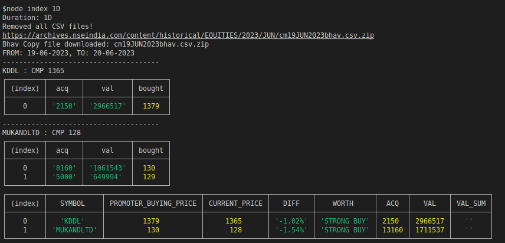

# nse-promoter-buying

A Node.js app to get the list of promoter buyers in recent (max 6 Months) times.

## Execution steps
--------------------
1. Goto website https://www.nseindia.com/companies-listing/corporate-filings-insider-trading, you will see table.
2. Select either 1D [1 day], 1W [1 week], 1M [1 month], 3M [3 months] or 6M [6 months] report.
3. copy the cookie for the request and paste it in our file `config/config.json`
4. Once the data is display, immediately come to the project terminal and execute command `node index <DURATION>` where `DUARTION` can be `1D`, `1W`, `1M`, `3M` or `6M`
5. Possible combinations to execute the command can be `node index 1D` OR `node index 1W` OR `node index 1M` OR `node index 3M` OR `node index 6M`
6. You should be able to see something as below.
